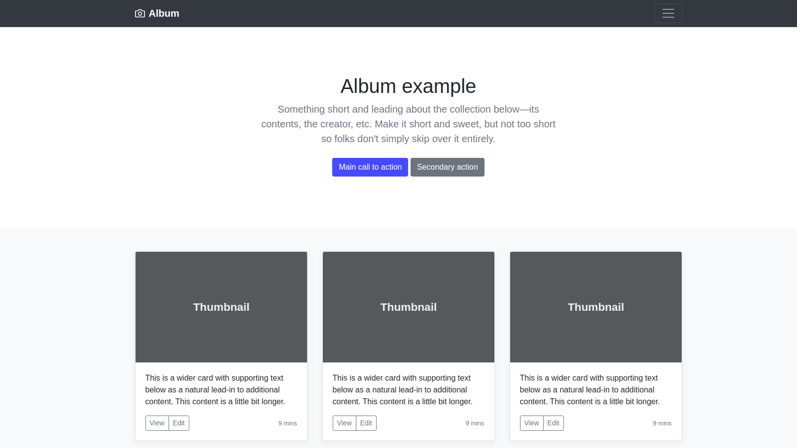

<h1 align="center">
   
  
   
JavaScript  
</h1>
<h4 align="center">8 exercices of JavaScript </h4>
 

## Exercices 🏋️

### Modification 1

La première modification a été apportée en utilisant la fonction changeTitles(). Elle a permis de changer le titre en haut de la page de "Album Example" à "Ce que j'ai appris à THP" et de modifier le sous-titre pour présenter THP comme une formation de 3 mois à plein temps offrant des connaissances actionnables.

### Modification 2

La deuxième modification a été réalisée avec la fonction changeCallToActions(). Cette fonction a permis de changer le texte du bouton principal en "OK je veux tester !" et d'ajouter l'URL "http://www.thehackingproject.org" comme lien pour ce bouton. De plus, le texte du bouton secondaire a été modifié en "Non Merci" et son URL a été définie comme "https://www.pole-emploi.fr/accueil/".

### Modification 3

La troisième modification a été effectuée en utilisant la fonction changeLogoName(). Elle a permis de modifier le titre de la navbar en remplaçant "Album" par "The THP Experience" et en augmentant la taille du texte.

### Modification 4

La quatrième modification a été réalisée avec la fonction populateImages(). Cette fonction a ajouté des images aux 9 cartes en utilisant un tableau d'URLs spécifié.

### Modification 5

La cinquième modification a été apportée avec la fonction deleteLastCards(). Cette fonction a supprimé les 3 dernières cartes en utilisant une boucle et la méthode remove() des objets ChildNode.

### Modification 6

La sixième modification a été effectuée en utilisant la fonction changeCardsText(). Cette fonction a modifié le texte des 3 premières cartes en remplaçant les descriptions existantes par des descriptions correspondantes aux technologies HTML, CSS et JS.

### Modification 7

La septième modification a été réalisée avec la fonction changeViewButtons(). Cette fonction a modifié tous les boutons "View" des cartes en leur attribuant la classe "btn-success" et en supprimant la classe "btn-outline-secondary".

### Modification 8

La huitième et dernière modification a consisté à ajouter une nouvelle div avec la classe "row" après celle qui contenait déjà les cartes, puis à déplacer la 3ème carte (JS) de la première div vers la nouvelle div créée.

## Technologies utilisées ⚙️

Pour ce programme les technologies suivantes ont été utilisé :  

 
 
Le site est responsive.

## Crédit 🔗

[Faria jean-baptiste](https://github.com/Jakfamily)
